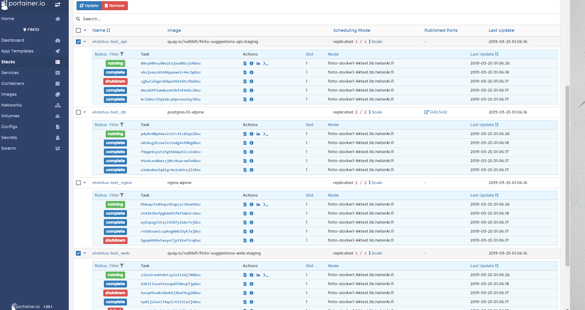
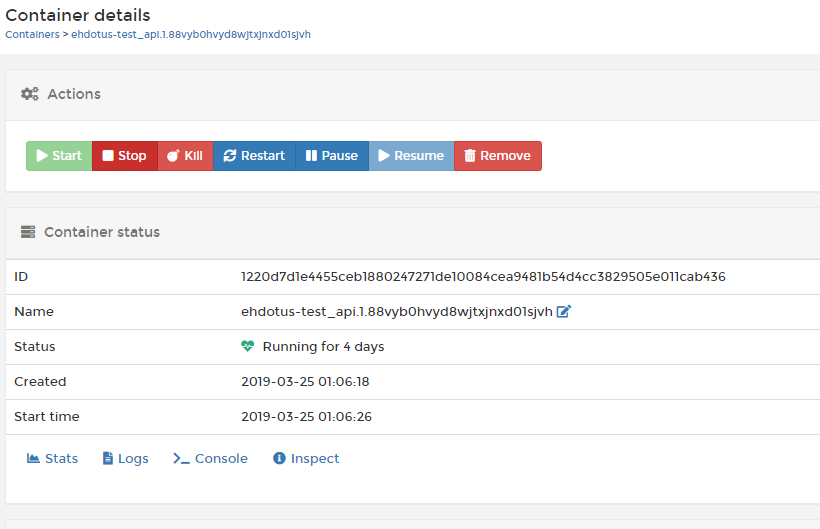

# Instructions for setting up and updating the staging environment

## 0. Prerequisites for updating the system

The main prerequisite is that the **develop** branch is ready for merging to the **master** branch, meaning that the development code has been tested after merging any feature or fix PR's into the develop branch.

NB. In the near future, some smoke testing unit tests should be added.

## 1. Updating to the latest version of the environment

### 1.1 Merging develop into the master

Merge the develop branch into the master branch, which then sets the **automatic build phase** into motion.

### 1.2 Automatic build phase

After the code is merged into master, the **drone.io** system starts building latest commits that are defined in the *.drone.yml config*.
Build processes are seen on the <https://drone.kansalliskirjasto.fi> page and it's good to check that no errors occur. After its completion, it will be automatically uploaded to the quay.io Docker repository. After a successful push to quay, you can go to the next phase.

### 1.3 Update services in Portainer 

There is currently any automatic hooks that would update service automaticly so you have to do it by hand. Go to Portainer's front page <https://portainer.kansalliskirjasto.fi> and log in. Go to finto node -> Stacks -> ehdotus-test

Check checkboxes for **web** and **api** from the left side and click **Update** on top of the page.
Under web and api, new containers are started, old ones are shut down and their statuses is turn into *running*.

Usually, these steps are all you need to do. However, sometimes you might have to run migrations or add user priviledges. These are discussed next in 1.3a and 1.3b.

#### 1.3a Newest feature has migrations

If newest image has migrations that needs to be run, usually these are knowledge the developer team some changenotes or something. Migrations sadly needed to run manually there is no more automatic behind that.

1. First log in to the Portainer service
2. Go to the **finto** node and find the **ehdotus-test** stack
3. Find the **ehdotus-test_api** service and open the currently running container by clicking on its name ()
4. Under *Start time*, there are some actions: click the **>_ Console** button.
5. Choose command **/bin/sh** and user can be root and click **Connect**
6. Sometimes this timeouts: get a cup of coffee and try again.
7. When you got in type in the console this command `flask db`, this will tell you will the flask db in initialized properly
8. Then just run command `flask db upgrade`, this will start running latest migrations to used database
9. After this you can log out and look is everything working on page as it should be.
10. In some cases if the migration is messed up or broken you might have to run also `flask db downgrade` and then fix the migration file.

#### 1.3b User needs admin priviledges

Currently, the suggestion system doesn't have functionality for changing user roles, so it has to be done by upgrading the database.

Go to Portainer and the **api** container's console (some notes above how to find this).

The container has a **pgcli** tool, which you can use to connect to the database (it can be used also to test if the db connection works).

Type in the console `pgcli -h <:host> -U <:user> -d <:database_name>` for connecting to the database.

**:host** is the host (in staging it is *ehdotus.dev.finto.fi*)
**:user** if not changed is *devuser*
**:database_name** if not changed is *devdb*

When connected, you can just run sql update to the selected user.
Example: `UPDATE users SET role='ADMIN' WHERE id=999;`

## 2. Install a new and fresh installation

### 2.1 Prerequisites

1. Create new branch for the new environment
2. Create new sections for environment in the drone config and new tags
3. Create new blank stack where this will be hosted
4. Create new GitHub app for this environment

### 2.2 Make branch ready for drone to build

Merge features to the new branch. Check that drone builds a new image and that the image and tags are delivered correctly to quay.

### 2.3 Config the host system

After this you can go to Portainer or where its hosted. If there can be use docker-compose, you should copy stating environment docker-compose from there.
First, update the image used to run services at least the correct tag and move all passwords and other critical information behind some security system that can be.
But at least change the name of the db, user and passwords and modifie all the enivrornment variables to has correct ones. Developer team can help with these but mainly what you need to change is github app client id and secret and also github user and token what is needed to fetch latest issues from github issue tracker.

The staging uses nginx proxy and trafik proxy so also copy used latest configs of them to new system if it uses them and configure them correctly to work new system. Mainly the host is the case that usually changed and certies for ssl.

Other things than update configs and environment variables in docker-compose file you should not needed to change if there is same kind of system that staging had.

### 2.4 Make db update

Go to the api container console and run migration upgrade the database, if everything went ok continue to next section.

### 2.5 OPTIONAL: Fetch old data from GitHub issue tracker

DISCLAIMER: this should be run only once, if this is not 100% run end whole database should be truncated.
To this run correctly, GITHUB_USERNAME and GITHUB_PERSONAL_TOKEN environments need to be set before running.

1. Go to the frontpage (**localhost:8080**) and create a new user for comments originally imported from GitHub. This must be done in an empty but previously upgraded database. The user must be the first user in the system. It's user role is 'NORMAL' and id must be 1 (automatically set up by next val -function in the db).
2. Open api service container console
3. Run `python -m scripts.prod_data_import`, which should fetch all the issues in the issue tracker and upload them to suggestion system's database
4. When the import is completed, close the console and you can check on the frontend page is everything correctly imported.

### 2.6 Create new GitHub app for environment

Go to GitHub's developer options <https://github.com/settings/developers>
Under OAuth apps, click 'Register a new application':

* **Application name**: uses naming convention of _*{environment}*
* **Homepage url**: Should be the main startpoint of page example: <https://ehdotus.dev.finto.fi>
* **Authorization callback URL**: This should be the url that github will redirect and it always has to be on the environment domain /auth/redirect/github. This can be also founded in environments so in case where domain is <ehdotus.dev.finto.fi> the redirect url is <https://ehdotus.dev.finto.fi/auth/redirect/github>. 

Now register the application. When registered, copy the **client id** and **client secret** to the new system's environment for api.

## 3. Other

### 3.1 Links

* Drone.io: <https://drone.kansalliskirjasto.fi/>
* Quay.io web repository: <https://quay.io/repository/natlibfi/finto-suggestions-web>
* Quay.io api repository: <https://quay.io/repository/natlibfi/finto-suggestions-api>
* Portainer service: <https://portainer.kansalliskirjasto.fi>

### 3.2 Problems

If you don't know how something works or encounter problems, you can ask **@artturi** or the project developer team for help.
