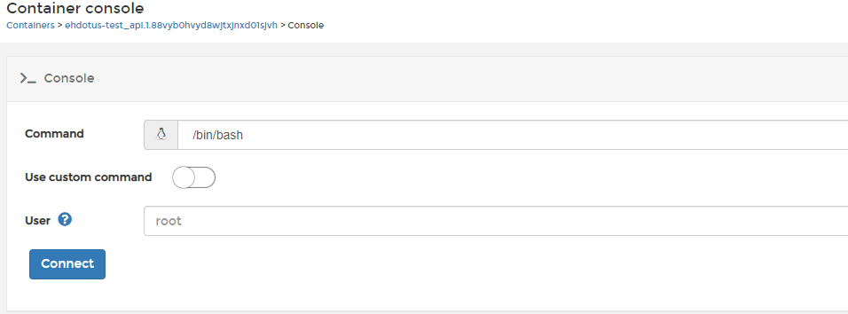

# Instruction how to update the staging enviroment

## Prerequisites for updating the system

The main prerequisite is that the code is ready for merging from the 'develop' branch, meaning that the development code has been tested after feature or fix PR's are merged.
This works for now – in the near future, there should be some smoke testing unit tests.

## Update latest version to enviroment

### Merge from develop-branch phase

Usually developer do this phase, merging all transfered featured from develop branch to master branch. And see that code don't has any conflicts.

### Automatic build phase

After code is merged to the 'master' branch, the drone.io system starts building latest commits from the 'master' branch that are defined in .drone.yml config.
Build process are seen in <https://drone.kansalliskirjasto.fi> page and it's nice to check that no errors occur. After its completion, it will be automaticly uploaded to quay.io docker repository. If it were successfully pushed to quay, you can go to the next phase.

### Portainer update services

There is currently any automatic hooks that would update service automaticly so you have to do it by hand. Go to portainer frontpage <https://portainer.kansalliskirjasto.fi> and log in. Go to finto node -> Stacks -> ehdotus-test

Check checkboxes 'web' and 'api' from left side and click button Update top of the page.
Might take a while to watch that under web and api new containers are started, old ones are shutdown and status is running.

That's usually all. I'll list down couple special cases what have to do then.

#### Newest feature has migrations

If newest image has migrations that needs to be run, usually these are knowledge the developer team some changenotes or something.
Migrations sadly needed to run manually there is no more automatic behind that.

1. First log in in the portainer service
2. Go to finto node and find the ehdotus-test stack
3. Find ehdotus-test_api service and open currently running container by clicking it name ()
4. Under start time there are some actions, click '>_ Console' -button or image.
5. Choose command /bin/sh and user can be root and push Connect ()
6. Sometimes this timeouts, best action for that is that you try after 10min again.
7. When you got in type in the console this command `flask db`, this will tell you will the flask db in initialized properly
8. Then just run command `flask db upgrade`, this will start running latest migrations to used database
9. After this you can log out and look is everything working on page as it should be.
10. In some cases if the migration is messed up or broken you might have to run also `flask db downgrade` and then fix the migration file.

#### User needs to upgrade to admin

Currently, the suggestion system don't have any functionality to change user role so mainly it has to done by upgrading database

Go to portainer and go to api container console (up has some notes how to get there).

In container has been installed pgcli -tool, you can use this to connect to database (it can be used also test if db connection works).

just type in console this command `pgcli -h <:host> -U <:user> -d <:database_name>`

:host: is the host, in staging it is ehdotus.dev.finto.fi
:user if not changed is devuser
:database_name if not changed is devdb

When connected, you can just run sql update to selected user.
Example: `UPDATE SET ROLE = 'ADMIN' WHERE user.id = 123;`

## Install new and fresh installation

### Prerequisite for fresh install

1. Create new branch for new enviroment
2. Create new sections for enviroment in the drone config and new tags
3. Create new blank stack where this will be hosted
4. Create new github app for enivroment

### Make branch ready to drone to build

Merge features to branch and see that drone build new image and that image and tags come correctly to quay.

### Configing host system

After this you can go to portainer or where its hosted. If there can be use docker-compose you should copy stating enviroment docker-compose from there.
First update image used to run services at least the correct tag and move all passwords and other critical information behind some security system that can be.
But at least change the name of the db, user and passwords and modifie all the enivrornment variables to has correct ones. Developer team can help with these but mainly what you need to change is github app client id and secret and also github user and token what is needed to fetch latest issues from github issue tracker.

The staging uses nginx proxy and trafik proxy so also copy used latest configs of them to new system if it uses them and configure them correctly to work new system. Mainly the host is the case that usually changed and certies for ssl.

Other things than update configs and enviroment variables in docker-compose file you should not needed to change if there is same kind of system that staging had.

### Make db update

Go to api container console and run migration upgrade the database, if everything went ok continue to next section.

### OPTIONAL: fetch old data from github issue tracker

DISCLAIMER: this should be run only once, if this is not 100% runned end whole database should be truncated.
To this run correctly GITHUB_USERNAME and GITHUB_PERSONAL_TOKEN environments needed to set before running

1. Open api service container console
2. Run this command `python -m scripts.prod_data_import`, this should fetch all the issues made in issue tracker and upload them to suggestion system database
3. When its completed, close the console and you can check on the frontend page is everything correctly imported

### Create new github app for enviroment

Go to GitHub's developer options <https://github.com/settings/developers>
Under OAuth apps, click 'Register a new application'

Application name has used namin convention as _{environment}
Homepage url: should be the main startpoint of page example: <https://ehdotus.dev.finto.fi>
Authorization callback URL: this should be the url that github will redirect and it always have to be on enviroment domain /auth/redirect/github. This can be also founded in enviroments so in case where domain is <ehdotus.dev.finto.fi> the redirect url is <https://ehdotus.dev.finto.fi/auth/redirect/github>. Register application. When registered copy the client id and client secret to new system enviroments for api.

### Links

Drone.io: <https://drone.kansalliskirjasto.fi/>
Quay.io web repository: <https://quay.io/repository/natlibfi/finto-suggestions-web>
Quay.io api repository: <https://quay.io/repository/natlibfi/finto-suggestions-api>
Portainer service: <https://portainer.kansalliskirjasto.fi>

### Need help

Something funny, don't know how to do it? Ask @artturi or project developer team what to do.
